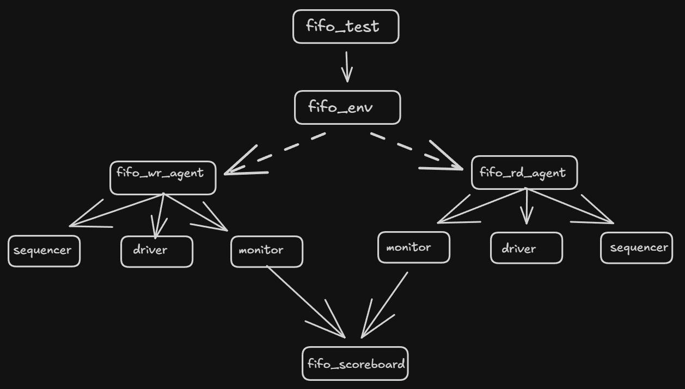
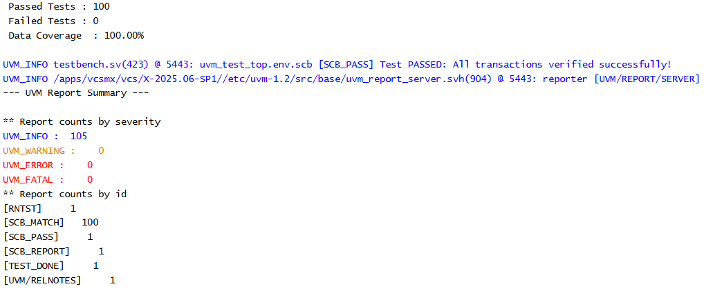

# Asynchronous FIFO — UVM Verification

SystemVerilog/UVM verification environment for a dual-clock asynchronous FIFO with independent read and write clock domains.


[TEST IT ON EDA PLAYGROUND](https://edaplayground.com/x/rtsh)

---

## 1. Design Overview

An asynchronous FIFO transfers data between two independent clock domains — a write domain (`wr_clk`) and a read domain (`rd_clk`) — with no fixed phase relationship between them.

Binary read/write pointers cannot cross clock domains directly, since more than one bit can change per cycle and risk metastability. Each pointer is converted to Gray code before crossing:

```text
gray = (binary >> 1) ^ binary
```

Gray code changes exactly one bit per increment. The pointer is then passed through a 2-flip-flop synchronizer in the receiving domain before use.

| Flag | Assertion condition |
|---|---|
| `empty` | Synchronized write pointer == read pointer |
| `full` | Write pointer == read pointer with top 2 bits inverted (write side one full buffer ahead) |

Writes are legal only when `full` is low; reads are legal only when `empty` is low.

## Files
- `fifo.v`: FIFO design and two flip-flop sync modules
- `fifo_uvm_tb.sv`: UVM testbench (interfaces, agents, driver, monitor, scoreboard, env, test, top)

## Default Parameters
| Parameter | Default | Meaning |
| --- | ---: | --- |
| `DATA_WIDTH` | 8 | Width of each data entry |
| `ADDR_WIDTH` | 4 | Number of address bits |
| `DEPTH` | 16 | Number of FIFO entries |

`DEPTH` must be equal to `2^ADDR_WIDTH`.

## Verification

The FIFO is verified with a complete UVM testbench that checks both data correctness and protocol behavior across the two independent clock domains.

### Testbench Architecture

The testbench has two separate agents — one for the write side and one for the read side.  
Each agent contains a driver (to send transactions), a monitor (to observe the interface), and a sequencer.  

Both monitors send observed transactions to a shared scoreboard. The scoreboard keeps a simple reference queue of written data and compares every read value against the expected data.



### How Checking Works

- The **write driver** only asserts `wr_en` when the FIFO is not full.  
- The **read driver** only asserts `rd_en` when the FIFO is not empty.  
- Monitors only forward transactions that were actually accepted by the FIFO.  
- The scoreboard compares every successful read against the data that was previously written.  
- At the end of the test it prints a clear summary: total transactions, matches, mismatches, and data coverage percentage.

### Protocol Checks (Assertions)

Two SystemVerilog assertions continuously watch the interfaces:

- A write is never allowed while the FIFO is full.  
- A read is never allowed while the FIFO is empty.  

These checks run in real time and report an error immediately if the protocol is violated.

### Functional Coverage

Coverage is collected on three important aspects:

- Write enable vs. full flag (to confirm both successful writes and blocked writes are exercised)  
- Read enable vs. empty flag (same idea on the read side)  
- Actual data values that successfully passed through the FIFO (grouped into low, mid, and high ranges)

This helps confirm that interesting corner cases and data ranges were hit during simulation.

### Results

At the end of every run the scoreboard prints a concise report showing how many transactions matched, how many failed, and the achieved data coverage.



### Simulation carried out in EDA Playground

## Static Timing Analysis (OpenSTA - gscl45nm)

| Clock  | Period (ns) | Frequency (MHz) | I/O Delay (ns) | WNS (ns) | TNS (ns) | Status   |
|--------|-------------|------------------|-----------------|----------|----------|----------|
| wr_clk | 10.00       | 100.00           | 1.00            | 0.00     | 0.00     | MET      |
| rd_clk | 8.00        | 125.00           | 1.00            | 0.00     | 0.00     | MET      |
| wr_clk | 2.00        | 500.00           | 0.30            | 0.00     | 0.00     | MET      |
| rd_clk | 2.00        | 500.00           | 0.30            | 0.00     | 0.00     | MET      |
| wr_clk | 0.60        | 1666.67          | 0.30            | -0.16    | -16.39   | VIOLATED |
| rd_clk | 0.60        | 1666.67          | 0.30            | -0.18    | -16.39   | VIOLATED |
| wr_clk | 0.80        | 1250.00          | 0.30            | 0.04     | 0.00     | MET      |
| rd_clk | 0.80        | 1250.00          | 0.30            | 0.02     | 0.00     | MET      |

**Estimated Fmax:** wr_clk ~1.32 GHz, rd_clk ~1.28 GHz

---

## 2. DUT Specification

| Parameter | Value |
|---|---|
| Data width | 8 bits |
| FIFO depth | 16 entries |
| Write clock | 100 MHz |
| Read clock | 40 MHz |
| Reset | Active-low |
| Clock domains | Independent async read/write |
| CDC mechanism | Gray-coded pointer sync, 2 FF stages |
| Verification methodology | UVM 1.2 |

---

## 3. Verification Objectives

| # | Objective | Check |
|---|---|---|
| 1 | FIFO ordering | Read data matches write order |
| 2 | Data integrity | Read data == corresponding written value |
| 3 | Full handling | No writes accepted while full |
| 4 | Empty handling | No reads accepted while empty |
| 5 | Write-pointer protection | Pointer stable while full |
| 6 | Read-pointer protection | Pointer stable while empty |
| 7 | Reset behavior | Status flags return to reset state |
| 8 | Concurrent operation | Independent read/write traffic |
| 9 | Boundary traversal | Empty, intermediate, full occupancy reached |
| 10 | Long-duration operation | Ordering holds under extended random traffic |

---

## 4. UVM Architecture


| Path | Flow |
|---|---|
| Write | Sequence → Sequencer → Driver → DUT write I/F → Monitor → Scoreboard |
| Read | Sequence → Sequencer → Driver → DUT read I/F → Monitor → Scoreboard |

Write and read agents run independently, producing asynchronous traffic across both clock domains.

---

## 5. Testbench Organization

```text
tb/
├── read_if.sv
├── write_if.sv
├── fifo_pkg.sv
├── tb_top.sv
│
├── sequence_items/
│   ├── fifo_wr_item.sv
│   └── fifo_rd_item.sv
│
├── sequences/
│   ├── fifo_wr_sequence.sv
│   ├── fifo_rd_sequence.sv
│   ├── fifo_fill_sequence.sv
│   └── fifo_drain_sequence.sv
│
├── agents/
│   ├── fifo_wr_sequencer.sv
│   ├── fifo_wr_driver.sv
│   ├── fifo_wr_monitor.sv
│   ├── fifo_wr_agent.sv
│   ├── fifo_rd_sequencer.sv
│   ├── fifo_rd_driver.sv
│   ├── fifo_rd_monitor.sv
│   └── fifo_rd_agent.sv
│
├── env/
│   ├── fifo_env.sv
│   └── fifo_scoreboard.sv
│
├── tests/
│   ├── fifo_random_test.sv
│   ├── fifo_fill_test.sv
│   ├── fifo_empty_test.sv
│   └── fifo_stress_test.sv
│
└── assertions/
    ├── wr_pointer_stable_when_full.sv
    ├── rd_pointer_stable_when_empty.sv
    └── fifo_bind.sv
```

All UVM classes are compiled through `fifo_pkg.sv`; `tb_top.sv` holds DUT instantiation, interfaces, clock/reset generation, and test startup.

---

## 6. Stimulus Strategy

| Element | Behavior |
|---|---|
| `wr_en` / `rd_en` | Randomized, not continuously asserted |
| Write accepted | `wr_en && !full` |
| Read accepted | `rd_en && !empty` |
| Constraint mix | Valid transfers, idle cycles, varying occupancy, full/empty transitions, async read/write overlap |

Drivers execute a transaction only when legal, preventing indefinite blocking at FIFO boundaries.

---

## 7. Test Plan

| Test | Stimulus | Intent |
|---|---|---|
| `fifo_random_test` | Concurrent constrained-random R/W | General functionality, ordering |
| `fifo_fill_test` | Continuous writes | `full` boundary |
| `fifo_empty_test` | Fill → drain | `empty` boundary |
| `fifo_stress_test` | Extended concurrent random traffic | Pointer wrap-around, long-term ordering |

All 4 tests share one reusable environment and scoreboard.

---

## 8. Reference Model / Scoreboard

| Metric | Source |
|---|---|
| Writes Captured | Valid writes from write monitor |
| Reads Captured | Valid reads from read monitor |
| Matches | Reads == reference queue |
| Mismatches | Data/order mismatch count |
| Queue Leftover | Unread entries at test end |
| Data Coverage | % of data-value bins hit |
| Occupancy Coverage | % of depth bins hit |

Model: SV queue; write → push, read → pop-and-compare.

---

## 9. SystemVerilog Assertions

### Interface

| Assertion | Domain | Requirement |
|---|---|---|
| No write while full | Write | `full` blocks write activity |
| No read while empty | Read | `empty` blocks read activity |
| Full reset state | Write | `full` low after reset |
| Empty reset state | Read | `empty` high after reset |

### Internal Pointer (bound via `bind`)

| Property | Requirement |
|---|---|
| Write pointer stability | No advance while full |
| Read pointer stability | No advance while empty |

`bind` keeps verification assertions separate from RTL.

---

## 10. Functional Coverage

**Interface**

| Coverpoint / Cross | Purpose |
|---|---|
| `wr_en` | Write enabled / disabled |
| `full` | Full / not-full |
| `wr_en × full` | Write activity at full boundary |
| `rd_en` | Read enabled / disabled |
| `empty` | Empty / non-empty |
| `rd_en × empty` | Read activity at empty boundary |

**Data**

| Bin | Range |
|---|---|
| Low | `0x00–0x55` |
| Mid | `0x56–0xAA` |
| High | `0xAB–0xFF` |

**Occupancy** (from scoreboard reference queue)

| Bin | Occupancy |
|---|---:|
| Empty | 0 |
| Low | 1–5 |
| Mid | 6–10 |
| High | 11–15 |
| Full | 16 |

---

## 11. Verification Results — Stress Test

| Stimulus | Count |
|---|---:|
| Write sequence items generated | 10,000 |
| Read sequence items generated | 10,000 |

| Scoreboard | Result |
|---|---:|
| Reads Captured | 2,690 |
| Matches | 2,690 |
| Mismatches | 0 |
| Queue Leftover | 0 |

| Coverage | Result |
|---|---:|
| Data Coverage | 100.00% |
| Occupancy Coverage | 100.00% |

Not every generated item produces a transfer — acceptance requires `en` asserted and legal FIFO state.

---

## 12. Tools

| Tool / Language | Usage |
|---|---|
| SystemVerilog | RTL interfaces, assertions, verification components |
| UVM 1.2 | Verification methodology |
| Synopsys VCS | Simulation |
| EDA Playground | Online compile/sim environment |

---

## 13. Running a Test

```text
fifo_random_test
fifo_fill_test
fifo_empty_test
fifo_stress_test
```

```systemverilog
run_test("fifo_stress_test");
```

Also configurable via simulator `+UVM_TESTNAME`.

---

## Static Timing Analysis (OpenSTA - gscl45nm)

| Clock  | Period (ns) | Frequency (MHz) | I/O Delay (ns) | WNS (ns) | TNS (ns) | Status   |
|--------|-------------|------------------|-----------------|----------|----------|----------|
| wr_clk | 10.00       | 100.00           | 1.00            | 0.00     | 0.00     | MET      |
| rd_clk | 8.00        | 125.00           | 1.00            | 0.00     | 0.00     | MET      |
| wr_clk | 2.00        | 500.00           | 0.30            | 0.00     | 0.00     | MET      |
| rd_clk | 2.00        | 500.00           | 0.30            | 0.00     | 0.00     | MET      |
| wr_clk | 0.60        | 1666.67          | 0.30            | -0.16    | -16.39   | VIOLATED |
| rd_clk | 0.60        | 1666.67          | 0.30            | -0.18    | -16.39   | VIOLATED |
| wr_clk | 0.80        | 1250.00          | 0.30            | 0.04     | 0.00     | MET      |
| rd_clk | 0.80        | 1250.00          | 0.30            | 0.02     | 0.00     | MET      |

**Estimated Fmax:** wr_clk ~1.32 GHz, rd_clk ~1.28 GHz

## Conclusion

| Result | Value |
|---|---:|
| Correctly ordered reads | 2,690 |
| Scoreboard mismatches | 0 |
| Residual expected transactions | 0 |
| Data / occupancy coverage | 100% / 100% |

Environment separates stimulus generation, protocol checking, reference-model checking, assertions, and functional coverage from the FIFO RTL.