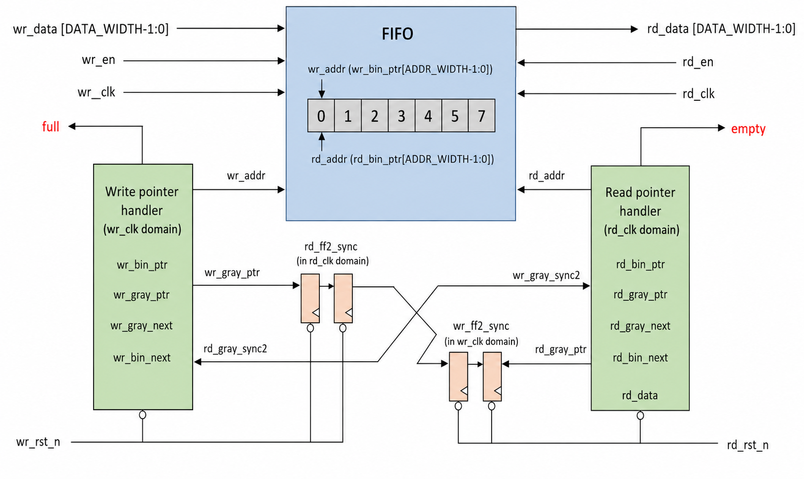

# Asynchronous FIFO

## Overview
This project implements an asynchronous FIFO in Verilog. It safely moves data between two clock domains that run at different speeds.
The write side uses `wr_clk`. The read side uses `rd_clk`. Each side has its own active-low reset.



## Key Features
- Separate read and write clocks
- Parameter-based data width and FIFO depth
- Gray code pointers for safe clock domain crossing
- Two flip-flop sync stages
- Full and empty flags
- UVM-based verification environment with a self-checking scoreboard
- SystemVerilog Assertions (SVA) for protocol checking
- Functional coverage on flow-control corner cases and data value ranges

## Architecture
The FIFO has three main parts:
1. A memory array stores the data.
2. The write side controls writes and the `full` flag.
3. The read side controls reads and the `empty` flag.

Binary pointers select the memory address. Gray code pointers are sent between the two clock domains.

## CDC and Pointer Synchronization
Binary pointers can change more than one bit at a time, so they are not sent across clock domains. Each binary pointer is first changed to Gray code:

```text
gray = (binary >> 1) ^ binary
```

Gray code changes only one bit for each pointer step. The Gray code pointer then passes through two flip-flops in the other clock domain. This lowers the risk of unstable values being used by the FIFO logic.

## Full and Empty Detection
The FIFO is empty when the next read Gray pointer matches the synced write Gray pointer.
The FIFO is full when the next write Gray pointer matches the synced read Gray pointer with its top two bits inverted. This shows that the write pointer has moved one full buffer length ahead of the read pointer.

Writes are allowed only when `full` is low. Reads are allowed only when `empty` is low.

## Files
- `fifo.v`: FIFO design and two flip-flop sync modules
- `fifo_uvm_tb.sv`: UVM testbench (interfaces, agents, driver, monitor, scoreboard, env, test, top)

## Default Parameters
| Parameter | Default | Meaning |
| --- | ---: | --- |
| `DATA_WIDTH` | 8 | Width of each data entry |
| `ADDR_WIDTH` | 4 | Number of address bits |
| `DEPTH` | 16 | Number of FIFO entries |

`DEPTH` must be equal to `2^ADDR_WIDTH`.

## Verification

The FIFO is verified with a complete UVM testbench that checks both data correctness and protocol behavior across the two independent clock domains.

### Testbench Architecture

The testbench has two separate agents — one for the write side and one for the read side.  
Each agent contains a driver (to send transactions), a monitor (to observe the interface), and a sequencer.  

Both monitors send observed transactions to a shared scoreboard. The scoreboard keeps a simple reference queue of written data and compares every read value against the expected data.


### How Checking Works

- The **write driver** only asserts `wr_en` when the FIFO is not full.  
- The **read driver** only asserts `rd_en` when the FIFO is not empty.  
- Monitors only forward transactions that were actually accepted by the FIFO.  
- The scoreboard compares every successful read against the data that was previously written.  
- At the end of the test it prints a clear summary: total transactions, matches, mismatches, and data coverage percentage.

### Protocol Checks (Assertions)

Two SystemVerilog assertions continuously watch the interfaces:

- A write is never allowed while the FIFO is full.  
- A read is never allowed while the FIFO is empty.  

These checks run in real time and report an error immediately if the protocol is violated.

### Functional Coverage

Coverage is collected on three important aspects:

- Write enable vs. full flag (to confirm both successful writes and blocked writes are exercised)  
- Read enable vs. empty flag (same idea on the read side)  
- Actual data values that successfully passed through the FIFO (grouped into low, mid, and high ranges)

This helps confirm that interesting corner cases and data ranges were hit during simulation.

### Results

At the end of every run the scoreboard prints a concise report showing how many transactions matched, how many failed, and the achieved data coverage.


### Simulation carried out in EDA Playground

## Static Timing Analysis (OpenSTA - gscl45nm)

| Clock  | Period (ns) | Frequency (MHz) | I/O Delay (ns) | WNS (ns) | TNS (ns) | Status   |
|--------|-------------|------------------|-----------------|----------|----------|----------|
| wr_clk | 10.00       | 100.00           | 1.00            | 0.00     | 0.00     | MET      |
| rd_clk | 8.00        | 125.00           | 1.00            | 0.00     | 0.00     | MET      |
| wr_clk | 2.00        | 500.00           | 0.30            | 0.00     | 0.00     | MET      |
| rd_clk | 2.00        | 500.00           | 0.30            | 0.00     | 0.00     | MET      |
| wr_clk | 0.60        | 1666.67          | 0.30            | -0.16    | -16.39   | VIOLATED |
| rd_clk | 0.60        | 1666.67          | 0.30            | -0.18    | -16.39   | VIOLATED |
| wr_clk | 0.80        | 1250.00          | 0.30            | 0.04     | 0.00     | MET      |
| rd_clk | 0.80        | 1250.00          | 0.30            | 0.02     | 0.00     | MET      |

**Estimated Fmax:** wr_clk ~1.32 GHz, rd_clk ~1.28 GHz
